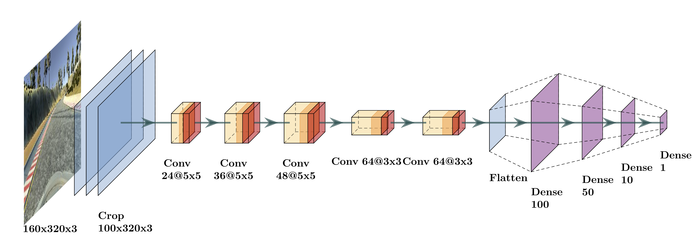

# Self-Driving Car Training

Alexis Nootens & Armen Hagopian

Convolutional Neural Network model for the [Udacity Self-Driving car simulator](https://github.com/udacity/self-driving-car-sim).<br>
Contains the model, the training script, and the launching script.



```
usage: train.py [-h] [-c]

Train a self-driving car.

optional arguments:
  -h, --help  show this help message and exit
  -c          Create a new model
```
The `train.py` file is used to create and/or train the model.<br>
You can either train a new model using the `-c` argument or train an existing one.<br>
File names such as model file or driving log cannot be passed as argument.

> train.py always looks for the model file "model.h5".<br>
> If the file exists and -c is not used, the model will be retrained.<br>
> If the file doesn't exist and -c is used, the file will be created.<br>
> No warranty is provided otherwise.

The `drive.py` file is used to launch the model and drive the car in the simulator.

## How to train a model
Two files are required:
- driving_log.csv
- validation_log.csv

Both are the same type of file and are generated from the simulator in training mode.
driving_log is the training set and validation_log.csv the test/validation set.
Both files must be in the same directory as the training script `train.py`.
Ensure the image files referenced by the logs are located in the subdirectory `IMG/` of the logs files.

Simply launch the training script
```
python3 train.py [-c]
```
The model file "model.h5" will be saved in the script directory.<br>
A training history log file will be produced named "model_history_log.csv"

## How to run a model
Ensure the model file "model.h5" is located in the same directory as the running script drive.py

Simply launch the running script
```
python3 drive.py
```
Then launch the simulator and select "autonomous mode".

## Model provided
A pre-trained model is provided in the repo.
This model has been trained for 200 epochs of 8000 images.
It can be used to immediately evaluate the architecture.

## Requirements
Built on python 3.7.3

Use `pip install -r requirements.txt` for fast install
- eventlet >= 0.24.1
- python-socketio >= 4.0.2
- numpy >= 1.16.3
- pandas >= 0.24.2
- matplotlib >= 3.1.0
- Pillow >= 6.0.0
- Keras >= 2.2.4
- tensorflow >= 1.13.1
- simple-pid >= 0.2.1

## Repository structure

The files described above, i.e., "train.py", "drive.py", "model.h5" and "requirements.txt" are in the root of the repository. 
The "/architecture" directory contains two files named "CNN_architecture.pdf" and "PlotNeuralNet_architecture.png" containing drawings of the architecture of the implemented convolutional neural network.

## References
 - Bojarski, Mariusz, et al. "End to end learning for self-driving cars." arXiv preprint arXiv:1604.07316 (2016).
 - N. Srivastava, G. Hinton, A. Krizhevsky, I. Sutskever, and R. Salakhutdinov, “Dropout: A Simple Way to Prevent Neural Networks from Overfitting,” p. 30 (2014).

